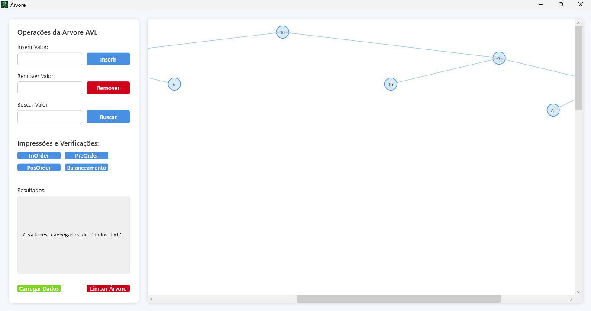
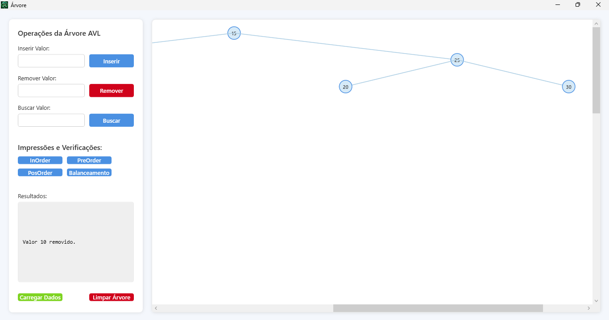
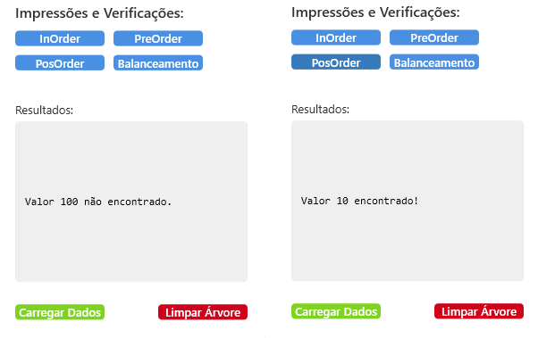
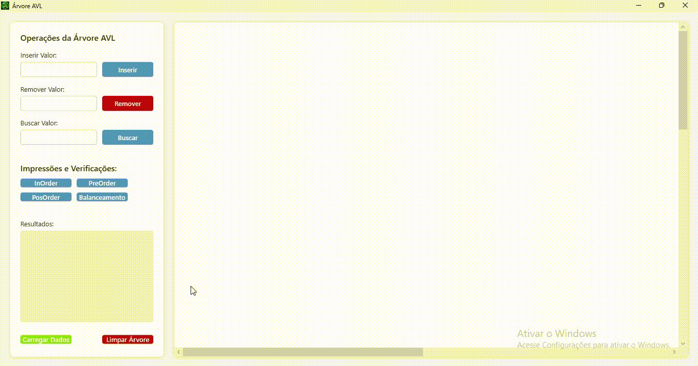
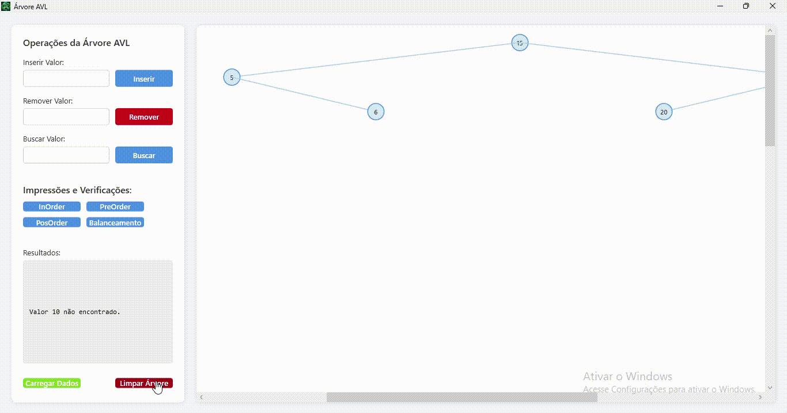

# 🌳 Projeto de Árvore AVL em C#

Este projeto implementa uma **Árvore AVL (Adelson-Velsky and Landis)** em C#, utilizando uma abordagem modular com dois projetos:
- **Class Library**: Contém a lógica da árvore AVL.
- **WPF App**: Visualização gráfica da árvore balanceada.

## 📚 Funcionalidades

- Inserção de nós na árvore
- Remoção de nós com balanceamento automático
- Busca de elementos
- Impressão da árvore (em ordem, pré-ordem, pós-ordem)
- Cálculo de altura e fator de balanceamento
- Visualização gráfica interativa da árvore (via WPF)

## 📸 Imagens do Projeto

### Console App

*Menu de interação com o usuário*


*Resultado do arquivo texto carregado* 


*Exemplo de remoção*


### Visualização Gráfica (WPF)

*Visualização dos Comandos*


*Visualização dos Comandos* 



### 🌀 Animações (GIFs)

*Balanceamento após inserções* 


*Visualização dinâmica* 


## 🛠️ Tecnologias Utilizadas

- C# (.NET)
- WPF para interface gráfica
- Paradigma de Programação Orientada a Objetos
- Estrutura modular em múltiplos projetos

## 🚀 Como Executar

1. Clone este repositório:
   ```bash
   git clone https://github.com/CarolineGrizante/TreeAVL-csharp.git
