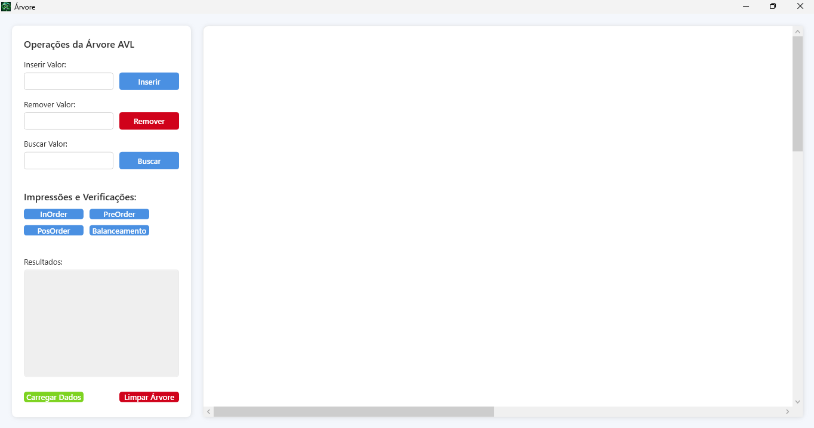

# 🌳 Projeto de Árvore AVL em C#

Este projeto implementa uma **Árvore AVL (Adelson-Velsky and Landis)** em C#, utilizando uma abordagem modular com três projetos:
- **Class Library**: Contém a lógica da árvore AVL.
- **WPF App**: Visualização gráfica da árvore balanceada.

## 📚 Funcionalidades

- Inserção de nós na árvore
- Remoção de nós com balanceamento automático
- Busca de elementos
- Impressão da árvore (em ordem, pré-ordem, pós-ordem)
- Cálculo de altura e fator de balanceamento
- Visualização gráfica interativa da árvore (via WPF)

## 📸 Imagens do Projeto

### 👨‍💻 Console App

Menu de interação com o usuário


Resultado do arquivo texto carregado 


Exemplo de remoção


### 🖼️ Visualização Gráfica (WPF)

Visualização dos Comandos


Visualização dos Comandos 


### 🌀 Animações (GIFs)

Balanceamento após inserções


Visualização dinâmica 


## 🛠️ Tecnologias Utilizadas

- C# (.NET)
- WPF para interface gráfica
- Paradigma de Programação Orientada a Objetos
- Estrutura modular em múltiplos projetos

## 🚀 Como Executar

1. Clone este repositório:
   ```bash
   git clone https://github.com/CarolineGrizante/TreeAVL-csharp.git
